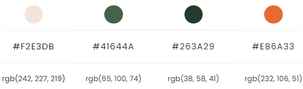
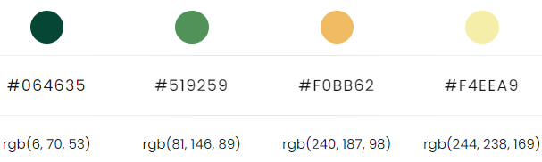

# Rainforest Cafe


[Visit my website here](https://alicehillier.github.io/rainforest-cafe/)

1. [Introduction](https://github.com/alicehillier/rainforest-cafe/#introduction)

2. [UX Design](https://github.com/alicehillier/rainforest-cafe/#ux-design)

    i. [Strategy Plane](https://github.com/alicehillier/rainforest-cafe/#strategy-plane)

    ii. [Scope Plane](https://github.com/alicehillier/rainforest-cafe/#scope-plane)
    
    iii. [Structure Plane](https://github.com/alicehillier/rainforest-cafe/#structure-plane)

    iv. [Skeleton Plane/Wireframes](https://github.com/alicehillier/rainforest-cafe/#skeleton-plane-/-wireframes)

    v. [Surface Plane](https://github.com/alicehillier/rainforest-cafe/#surface-plane)

3. [Features](https://github.com/alicehillier/rainforest-cafe/#features)

    i. [Existing Features](https://github.com/alicehillier/rainforest-cafe/#existing-features)

    ii. [Features to be implemented in the future](https://github.com/alicehillier/rainforest-cafe/#features-to-be-implemented-in-the-future)

4. [Technology Used](https://github.com/alicehillier/rainforest-cafe/#technology-used)

    i. [Main Languages](https://github.com/alicehillier/rainforest-cafe/#main-languages)

    ii. [Frameworks, Libraries and Programmes](https://github.com/alicehillier/rainforest-cafe/#frameworks-,-libraries-and-programmes)

5. [Issues and Bugs](https://github.com/alicehillier/rainforest-cafe/#issues-and-bugs)

6. [Deployment](https://github.com/alicehillier/rainforest-cafe/#deployment)

7. [Testing](https://github.com/alicehillier/rainforest-cafe/#testing)

8. [Credits](https://github.com/alicehillier/rainforest-cafe/#credits)

9. [Acknowledgements](https://github.com/alicehillier/rainforest-cafe/#acknowledgements)


## **Introduction**

Welcome to Rainforest Cafe’s website! Located in the heart of London’s Soho district, we’ve brought a little piece of the rainforest to one of the world’s busiest cities. Relax in our plant-filled cafe, or soak up the sun in our tropical garden. Feast on our naturally delicious treats and feel good for doing good, by dining with a sustainable and fairtrade business.
Rainforest Cafe is a fictional business, created by Alice Hillier for the first project in Code Institute’s Diploma in Software Development programme.

## **UX Design**

### **Strategy Plane**

In order to gauge what makes a successful restaurant website, I undertook online research to find common themes, features and layouts. 
Some of the restaurant websites I researched were:

#### **Las Iguanas** 

-	Offers Latin American cuisine
-	Horizontal navbar, with repeated links throughout the page
-	Vibrant background colours/links
-	Lots of images of colourful food and tropical locations/beaches
-	Large fonts
-	Features include – ‘book now’ button on top right corner, menu, about, find us, deliveries, parties, shop
-	Subscription prompt at the bottom of the page

#### **Nando’s**

-	Offers barbecued chicken in a variety of sauces (some vegetarian options available)
-	Horizontal navbar, with repeat links throughout the page
-	Primarily white background with vibrant links and images of colourful food
-	Medium to large fonts
-	Features include – ‘order online’ button on top right corner, menu, loyalty scheme, restaurants, cook, about us, help, careers
-	Subscription prompt underneath header

#### **Turtle Bay**

-	Offers Caribbean cuisine
-	Horizontal navbar, with repeated links throughout page
-	Vibrant background colours/links
-	Lots of images of colourful food, cocktails and tropical locations
-	Features include – ‘book now’ button on top right corner, menu, locations, bottomless, happy hour, delivery, community
As part of my research, I also conducted interviews to identify what a user wants or needs from a restaurant website.

### **User Stories**

#### **First-Time Visitor Goal**

-	I want to find out what type of food I can expect from this restaurant
-	I want to find out about the restaurant’s theme and atmosphere
-	I want to know the location and opening times of the restaurant
-	I want to see if I like anything on the menu and if vegetarian options are available
-	I want to find what I’m looking for quickly, without having to read too much or follow too many links

#### **Returning Visitor Goal**

-	I want to see if there are any special offers
-	I want to see if I can book a table at my preferred location

#### **Frequent Visitor Goal**

-	I want to see if there is a loyalty scheme
-	I want to subscribe to the newsletter for special offers and discounts
-	I want to visit the restaurant’s social media profiles to find new offers
-	I want to know if there are new additions to the menu
-	I want to know if I can buy any of the restaurant’s products to cook at home

### **Scope Plane**

Based on the research conducted in the Strategy Plane, I decided to include the following features in Rainforest Cafe’s website:
-	‘Book Now’ button and Book Now page
-	Find Us page with opening times and contact information
-	Menu page
-	About Us section on the landing page
-	Social media links at the bottom of each page as well as conventional footer links
-   Form acceptance page and error page to deliver a more authentic experience.

I made the following design choices based on research of competitors’ websites: 
-	Use vibrant colours to reflect the theme of the restaurant
-	Use plenty of images to show the restaurant’s products and atmosphere

I ensured that I met the following functionality requirements:
-	Users can navigate to the correct section quickly and easily
-	Use less text and more images to convey information to users
-	Users can use the website comfortably on different devices

### **Structure Plane**

The contents of the website were carefully considered and selected for their relevance and usefulness to users. 

I decided to include only a small number of links in the navbar to avoid confusing users. The links were those that I found most common on other restaurant websites and, just as importantly, related to several of the points mentioned in the user stories.

I also chose to separate the website into pages, so users wouldn't have to scroll endlessly to find the desired information. As the website features the restaurant's comprehensive menu, I felt that this feature in particular would cause frustration if it were to be implemented in a single-page website.

### **Skeleton Plane**

When starting to design my website, I created detailed wireframes using Balsamiq. I considered how the website would appear on desktop, tablet and mobile devices, and prepared a set of wireframes which would show how the website would look as users scrolled through each page.
To view the wireframes, please click on the links below:
- Wireframes for desktop
- Wireframes for tablet
- Wireframes for mobile

### **Surface Plane**

After establishing the content of the website, I began putting together the aesthetics. 

#### **Colour Scheme**

Given the theme of the restaurant, I wanted to use natural colours. I used Color Hunt to find a suitable palette.

##### [Palette 1](https://colorhunt.co/palette/f2e3db41644a263a29e86a33)



The primary colour used across the website is from this palette. The darker shade of green, #263A29, was applied to the navbar in the header and the social media links bar in the footer. This colour is also used for text that appears on a white background.

The lighter shade of green, #41644A, is used for menu navbar on the Menu page.

##### [Palette 2](https://colorhunt.co/palette/064635519259f0bb62f4eea9)



I selected softer colours from this palette, to be used as background colours for each menu course section on the Menu page. I alternated between #519259, a lighter shade of green, and #F0BB62, a pale orange colour.

#### **Typography**

I employed a consistent font across my website, which was sourced from Google Fonts. 

K2D is a sans-serif font, ensuring that it is legible and comfortable to read. 

#### **Imagery**

When selecting images for my website, I wanted to make sure that they were colourful, informative, and reflected the restaurant's theme. All images were sourced from Pexels and Unsplash.

##### **Homepage**

The hero image on the homepage is the user's first look at what the restaurant has to offer. The image conveys the theme of the restaurant well, showing greenery, colourful healthy food and a sophisticated set up styled with natural materials.

The About Us section, which is made up of four columns, gives the user a clear idea of what is special about the restaurant. 

The first column, 'Our Food', shows a selection of fresh and colourful fruits. This suggests to the user that the food offered is natural and healthy.

The second column, 'Our Environment', shows an outdoor dining setting. With plenty of greenery, wooden beams, warm lighting and elegant dining furniture, the user is intended to feel as though they are in a garden, a world away from city life.

The third column, 'Our Partners', shows fresh fruit growing on a tree. This, again, suggests to the user that the ingredients used by the restaurant are fresh and natural. 

The fourth and final column, 'Our Planet', depicts two howler monkeys sitting in a tree. This suggests to the user that the restaurant is related to, and cares about, the natural world. This is an encouraging message as it reassures potential diners that the restaurant is not only good for them, but for the environment too.

The section link images towards the bottom of the page reflect their respective links and are consistent with the details of the restaurant's location and products. The dark filter applied to the images ensures that the text is legible and eye-catching. 

##### **Menu**

The menu page has many images, showing the user what food is served at the restaurant. The images are colourful and show fresh, healthy and natural food. The user is able to see if the food served appeals to them and what quality they should expect.

##### **Find Us**

The map displayed on this page was found on Google Maps. I took a snippet of the image so that users would be able to locate the restaurant more easily.

##### **Book Now**

The background image, which extends across the full height and width of the page, shows plenty of greenery in an indoor setting. This, again, conveys the natural theme and aesthetic of the restaurant.

## **Features**

### **Homepage**

#### **Navbar**

The navbar is fixed to the top of the screen and extends across the entire width of the page. On smaller devices, the navbar doubles in length in order to allow ample space between links. This limits the opportunity for accidentally pressing links. The name of the page currently being viewed is underlined, so users won't become lost.

The navbar consists of these 5 links:

1. Restaurant Name: Links to homepage

2. Home: Links to homepage

3. Menu: Links to a page consisting of the restaurant's entire menu, structured in clear sections with meal descriptions and prices.

4. Find Us: Links to a page consisting of a clickable map, which takes the user to the exact location on Google Maps,the restaurant's address, telephone number and email address. 

5. Book Now: Links to a form page, which asks for relevant details regarding users' booking. The submit button at the bottom of the form is centered and easy to identify.  

I chose to include only a small number of links that would have value for users and prevent them from spending too much time trying to locate the desired information.

#### **Hero Image and Welcome Section**

Beneath the navbar, users see the large hero image, which has a zoom-out animation as the page loads. The hero image is followed by a short welcome section, which consists of the restaurant's name and a brief description of it's theme.

#### **About Us**

Scrolling down, users see a four-column grid with the headings 'Our Food', 'Our Environment', 'Our Partners' and 'Our Planet'. Underneath each heading, an image covers the width of the column, with a short description relating to each heading underneath.

#### **Section Links**

Towards the bottom of the page, a grid of three columns holds an image, evenly sized and spaced. An h2 is centered in each image. The entire image, as well as the text, links to its named page. When the user hovers over the image, its opacity is reduced, indicating that is being interacted with.

#### **Footer**

Sitting at the bottom of the page, a bar of green, matching the navbar, stretches across the entire width of the page. Social media links, identifiable by their logos, are spaced evenly in the center. 

### **Menu**

The main content of the menu page is made up of 4 containers, with 8 cards in each. The first card in each container displays an h2, which indicates what type of content the user should expect to see in that section. The sections are well-defined, using alternating colours to indicate to the user when they are looking at a different section.

Sitting on top of the first container is a small navbar for the menu, so the user can easily navigate to a specific section if they desire. When each link is hovered over, an underline appears, so the user can see that they can click on the link and visit that specific section.

In each food/drink item card of each container, the user can see an image of the food/drink, its name, logos denoting if it is suitable for vegan, vegetarian or gluten-free diets (each with a title stating the logo's meaning), a short description of the meal, and its price. All content is centered in the card and has ample spacing for easy reading.

### **Find Us**

This page is split into two columns. The first column features a map, which, when clicked on, takes the user to the precise location of the restaurant on the interactive Google Maps. The top part of the second column lists the address of the restaurant, its phone number and email address. This information is labelled with easily-identifiable and brightly-coloured icons. The address of the restaurant is labelled with a red pin icon, the phone number with an orange telephone icon, and the email address with a green envelope icon. The bottom part of the second column displays the opening times of the restaurant. The columns are aligned and evenly spaced.

### **Book Now**

The booking page features a white booking form, with a simple plant background to make it more visually appealing, but not overwhelming. 

The booking form asks for relevant information from the user and consists of select options, a date input, a textarea and text inputs. All input fields, except for the textarea, which is a space for additional information, are required and validated. The form is well-spaced and places the labels alongside their respective inputs. This reduces excessive length of the form and allows the user to review the information they input easily before submitting their form.

The large 'BOOK NOW' button at the bottom of the form is centered and has inverted colours to capture the user's attention. When clicked, the 'BOOK NOW' submit button takes the user to a page which thanks them and outlines the next steps.

### **Thank You Page**

This page is concise and offers a more authentic booking experience. It exists as a means to reassure the user that their form has been submitted and received. The user is informed of the next steps, which eliminates any concerns of their booking being lost or not received.

### **Features to be implemented in the future**

The following features would be an excellent means to create a fuller experience for the user:

1. Use Bootstrap to implement a hamburger menu in the navbar.

2. Add footer links and their respective pages.

3. Add a page for recipes/tips.

4. Add a page about environmentally-friendly ideas or practices employed by the restaurant.

5. Add a FAQs page.

6. Add a subscription form to promote offers and engage with users.

## **Technologies Used**

### **Main Languages**

- HTML
- CSS

### **Frameworks/Libraries/Programmes Used**

- W3Schools: Used to validate HTML and CSS documents, and to look for ideas and guidance about how to implement my designs. I also used their code to create a 'Back to Top' button on the Menu page.

- MDN Web Docs: Used to look for ideas and guidance about how to implement my designs.

- Unsplash and Pexels: All images and the video on the homepage were sourced from these websites.

- Google Fonts: "K2D", the font used across the entire website, was sourced from Google Fonts.

- Font Awesome: Social media link icons and individual letter icons for vegan, vegetarian and gluten-free items on the food menu were sourced from Font Awesome.

- Visual Studio Code: I used this local editor to write and edit my code. 

- Git: I committed and recorded my work using Git.

- Github: I stored my work on Github and shared my project, as well as its record of development.

- Balsamiq: I designed the low-fidelity wireframes for all devices using Balsamiq.

- Tiny PNG: I used Tiny PNG to compress image files, in turn optimising performance.

- Color Hunt: I used Color Hunt to identify appropriate colours for the website's theme.

## **Issues and Bugs**

1.  On a physical iOS mobile and tablet, the menu navigation bar on the menu page did not have centered text, despite appearing centered on inspect. 

2.  Issue: On a physical iOS mobile and tablet, the user could swipe left and right to see white space. 

    Solution: I removed the animation for the hero image on the homepage and the whitespace was no longer visible.

3.  Issue: On small screen sizes (approximately 300-400px), not all the social media links were showing.

    Solution: I doubled the height of the bar and adjusted the width of the icons for screens up to 600px, which meant all icons were evenly-sized, evenly-spaced and visible.

4.  Issue: On the 'Find Us' page, the map could not be clicked on, so the user couldn't see the interactive map or a broader view of the location.

    Solution: I realised that I had placed the anchor tag within the div, around another div. So, the anchor tag was applied to the inner div, which had no properties set. I moved the anchor tag outside of the outer div, which then allowed the user to click the working link. 

5.  Issue: Realising I'd set all images as background, which was incorrect, when re-setting them with the img tag, the images appeared stretched or not filling their      
    containers as expected. 

    Solution: I tested a few properties in CSS, including object-fit. I ruled out which ones didn't work, such as 'contain' and 'fill', and found that 'object-fit: cover;' gave me the desired result.

6.  Issue: Loading times were very slow, particularly on the menu page.

    Solution: I asked my peers for feedback on Slack, and one of them recommended I use the "loading=lazy" attribute to improve the experience. I applied this attribute to all images in the About Us section on the homepage and all images on the Menu page, which seems to have improved the loading times.

### Unresolved Issues and Bugs

1. On smaller screens, the homepage has white space on all sides when dragged. This does not appear to happen on the other pages, so this may be due to the scale animation used for the hero image.

## **Deployment**

The project was developed using Visual Studio Code as the code editor, committed to Git as a local repository, and then pushed to GitHub for storage.

### **Deployment to GitHub Pages**

The project was deployed to GitHub Pages using the following steps:

1. Log in to GitHub.
2. Navigate to the main page of GitHub Repository that will be deployed.
3. At the top of the Repository, find the "Settings" button on the menu and click on it.
4. Inside the settings, on the left side of the page, there’s a list of tab menu. Find the “Pages” tab, and click on it.
5. Under "Source", click on the dropdown item called "None", select "Master", and then click on the “Save” button.
6. The page will automatically refresh.
7. Now you should see a notification message that provides the now published site link: “Your site is ready to be published at https://alicehillier.github.io/rainforest-cafe/”.

### **Forking the GitHub Repository**

By forking the GitHub repository you can make a copy of the original repository on your GitHub account. You can view and/or make changes to this copy, without affecting the original repository, by using the following steps:

1. Log in to GitHub.
2. Navigate to the main page of the GitHub Repository that you want to fork.
3. At the top right of the Repository, just below your profile picture, find the "Fork" button.
4. You should now have a copy of the original repository in your GitHub account.
5. Changes made to the forked repository can be merged with the original repository via a pull request.

### **Making a Local Clone**

By cloning a GitHub Repository, you can create a local copy on your computer of the remote repository. This allows you to make all of your edits locally, rather than directly in the source files of the origin repository, by using the following steps:

1. Log in to GitHub
2. Navigate to the main page of the GitHub Repository that you want to clone.
3. Above the list of files, click on the dropdown item called "Code".
4. To clone the repository using HTTPS, copy the link under "HTTPS".
5. Open Git Bash.
6. Change the current working directory to the location where you want the cloned directory to be made.
7. Type `git clone`, and then paste the URL you copied in Step 4.

```
$ git clone https://github.com/YOUR-USERNAME/YOUR-REPOSITORY
```

8. Finally, press Enter. Your local clone has now been created.

```
$ git clone https://github.com/YOUR-USERNAME/YOUR-REPOSITORY
> Cloning into `CI-Clone`...
> remote: Counting objects: 10, done.
> remote: Compressing objects: 100% (8/8), done.
> remove: Total 10 (delta 1), reused 10 (delta 1)
> Unpacking objects: 100% (10/10), done.
```

Changes made on the local machine (cloned repository) can be pushed to the upstream repository directly if you have a write access for the repository. Otherwise, the changes made in the cloned repository are first pushed to the forked repository, and then a pull request is created.

[Click Here](https://docs.github.com/en/github/creating-cloning-and-archiving-repositories/cloning-a-repository-from-github/cloning-a-repository) for a more comprehensive guide on how to complete the above process.

## **Testing**

## **Credits**

- Pexels and Unsplashed: All images were sourced from these two websites.

- Font Awesome: All icons were sourced from this website.

## **Acknowledgements**

- My mentor, Oluwaseun Owonikoko, for her patience, support and consistent constructive feedback.
- My peers, for their continued support and advice.
- My husband, Norman, for his constant encouragement and for testing the website regularly.

[Back to top](https://github.com/alicehillier/rainforest-cafe/#rainforest-cafe)